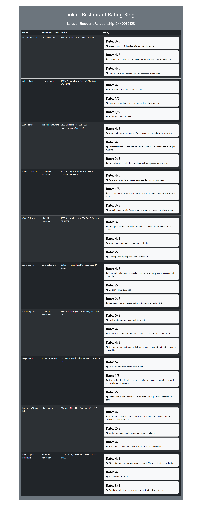

Nama: Vika Valencia Susanto\
NIM: 2440062123\
Pemanasan Sebelum UAS (Eloquent Relationship) Web Prog 2 (LA06)

Laravel Eloquent Relationship
--------------------------------------
Page yang dibuat merupakan page review dan rating restoran yang memuat satu tabel dengan 4 kolom/variabel yaitu owner, nama restoran, alamat, dan rating. Setiap variabel (nama owner, nama resto, alamat, rating, konten) digenerate dengan menggunakan function "faker".
- One to one: Ada 10 owner dan setiap owner masing-masing memiliki satu restoran 
- One to many: Setiap restoran memiliki 3 review (rating dan content)


Page Screenshots
--------------------------------------



Frameworks Used
--------------------------------------
- Laravel
- Bootstrap


Installation
--------------------------------------
1. Pastikan node.js dan laravel sudah tersedia

2. Pastikan vite sudah terinstall dan sudah dijalankan\
    Untuk menginstall vite
    ```
    vite install 
    ```
    atau
    ```
    npm install
    ```

    Untuk menjalankan vite
    ```
    npm run dev
    ```

3. Menjalankan laravel
    ```
    php artisan serve
    ```
    
    - Jika terdapat error saat menjalankan kode, berikut penyelesaian dari error tersebut:
      ```
      composer install
      ```
    
    - jika terdapat error "key not generated" atau "500|server error" pada web
      ```
      php artisan key:generate
      ```
    
    - Jika pada saat menjalankan syntax ini terdapat error tidak dapat menemukan file .env, maka rename dahulu file .env.example menjadi .env kemudian jalankan kembali syntax tersebut
    
    - Jika terdapat error "vite manifest not found" pada web, lakukan:
      1. ```
         npm install --save-dev vite laravel-vite-plugin
         ```
      2. Lalu update package.json file "scripts": { "dev": "vite", "build": "vite build" }
      3. ```
         npm run build
         ```
    
    - Menjalankan laravel
      ```
      php artisan serve
      ```
